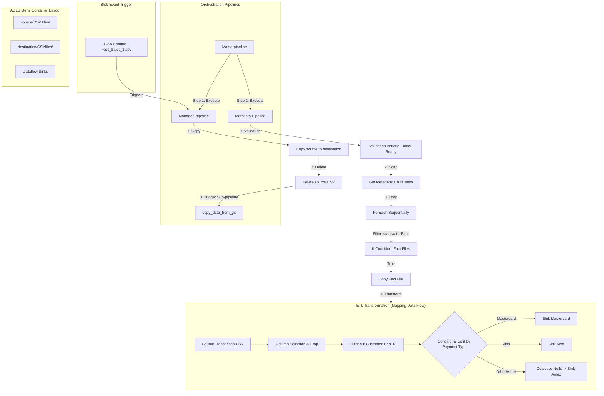

# Azure Data Factory (ADF) Learning & Practice Projects

This repository contains a collection of training and pattern-practice pipelines built in Azure Data Factory. The workflows demonstrate intermediate and advanced concepts including event-driven pipelines, automated source cleanup, metadata validation, sequential conditional looping, pipeline variables, and Mapping Data Flow conditional splits.

---

## 🚀 Key Patterns & Concepts Demonstrated

*   **Event-Driven Archival (Cut-and-Paste):** Uses a Blob Events Trigger to capture file uploads, execute copy processes, and clean up source folders via the `Delete` activity.
*   **Sequential Metadata Processing:** Validates container readiness before scanning file directories, iterating through results sequentially, and filtering items by filename prefix (`startswith`).
*   **Data Masking & Conditional Splitting:** Dataflow transformations to exclude sensitive data columns (PCI compliance) and partition transactions into distinct payment streams (Visa, Mastercard, American Express).
*   **External HTTP Data Ingestion:** Downloads raw flat-files from public/private GitHub endpoints into ADLS Gen2 storage using HTTP linked services.
*   **Variable State Management:** Demonstrates the use of pipeline-scoped variables to capture and store dynamic arrays of metadata for downstream utilization.

---

## 📐 Architecture & Orchestration Flow

---

## 📁 Repository Structure

*   [**`/pipeline`**](./pipeline): Orchestration flows containing wrapper runs, conditional loops, metadata operations, and variable updates.
*   [**`/dataflow`**](./dataflow): Mapping Data Flow defining select, filter, derived columns, conditional splitting, and multi-sink writes.
*   [**`/dataset`**](./dataset): File dataset templates (CSV, HTTP endpoints, partitioned ADLS targets).
*   [**`/linkedService`**](./linkedService): Connection settings for Azure Data Lake Gen2 storage and GitHub raw HTTP servers.
*   [**`/trigger`**](./trigger): Event trigger definitions configured for storage events.

---

## 🛠️ Pipeline Details

### 1. Master Pipeline (`Masterpipeline.json`)
A high-level orchestration wrapper that forces sequential execution of related pipelines.
1.  **ExecuteManagerPipeline (Execute Pipeline):** Runs `Manager_pipeline` to copy, archive, and fetch reference data.
2.  **ExecuteMetadata (Execute Pipeline):** Once the manager finishes successfully, it triggers the metadata loop.

### 2. File Ingestion & Archival Manager (`Manager_pipeline.json`)
Demonstrates a safe file-archival ingestion process triggered automatically by file arrivals.
1.  **Copydatafromsourcetodestination (Copy):** Moves the arriving `Fact_Sales_1.csv` file from `source/CSV files/` to `destination/CSVfiles/`.
2.  **Delete1 (Delete):** Deletes `Fact_Sales_1.csv` from the source container upon successful copy completion to prevent redundant processing.
3.  **Execute git (Execute Pipeline):** Calls the `copy_data_from_git` pipeline to refresh local staging layers with raw GitHub reference files.

### 3. Metadata Loop & ETL Trigger (`Metadata.json`)
Demonstrates robust operational validation and prefix-filtered looping.
1.  **Validation1 (Validation):** Holds execution until the target storage directory is detected and available.
2.  **Get Metadata (GetMetadata):** Retrieves the file listing (`childItems`) from the destination container.
3.  **ForEach1 (ForEach - Sequential):** Iterates over files one by one.
4.  **If Condition1 (IfCondition):** Evaluates if the filename begins with `"Fact"` (`@startswith(item().name, 'Fact')`).
    *   **If True:** Runs a parameterized copy activity (`Copy data1`) to copy the file to a targeted staging path.
5.  **Data flow1 (ExecuteDataFlow):** Triggers the `Dataflow_Source` ETL flow once the metadata looping completes.

### 4. Raw Git Ingestion (`copy_data_from_git.json`)
Uses an anonymous HTTP Linked Service pointing to `raw.githubusercontent.com` to ingest delimited text files directly into ADLS Gen2 folders.

### 5. Variable Assignment practice (`Variable_pipeline.json`)
A pipeline used to practice array variable operations:
1.  **Get Metadata:** Scans a folder for `childItems`.
2.  **Set variable:** Assigns the output array of child items to an ADF array variable named `Variable`.

---

## 📊 Mapping Data Flow: `Dataflow_Source.json`

This Spark-powered ETL job cleanses and splits transaction streams based on payment types.

1.  **Source (`sourceCSV`):** Reads transactional csv files containing purchase columns.
2.  **Select (`select`):** Drops credit card numbers and loyalty card flags to ensure data privacy (PCI DSS compliance).
3.  **Filter (`filter`):** Excludes test accounts or corrupted customer logs (`customer_id != 12 && customer_id != 13`).
4.  **Conditional Split (`SplitByPayment`):** Partitions transactions into three streams:
    *   **Mastercard:** Writes to Mastercard sink.
    *   **Visa:** Writes to Visa sink.
    *   **American Express (Default):** Coalesces null fields (`coalesce(payment, 'No Payment')`) and writes to the Amex sink.
5.  **Sinks:** Outputs files back to ADLS Gen2 using the parameterized dataset `Dataflow_Destination`.

---

## 📂 Dataset Catalog

| Dataset Name | Type | Linked Service | Location (Container/Folder/File) | Purpose |
| :--- | :--- | :--- | :--- | :--- |
| **`Copy_source`** | CSV | `AzureDataLakeStorage1` | `source/CSV files/Fact_Sales_1.csv` | Represents the input data file. |
| **`Copy_Destination`** | CSV | `AzureDataLakeStorage1` | `destination/CSVfiles/` | Primary landing path for file copy. |
| **`Folderselect`** | CSV | `AzureDataLakeStorage1` | `source/CSV files/` | Target folder validation. |
| **`Metadata_source`** | CSV | `AzureDataLakeStorage1` | `source/` | Target metadata scanning source. |
| **`Metadata_Source__foreach_IF`** | CSV | `AzureDataLakeStorage1` | `destination/CSVfiles/{Parameter}` | Dynamic source path mapping. |
| **`Metadata_destination_Foreach_IF`**| CSV | `AzureDataLakeStorage1` | `destination/CSVfiles/{Parameter}` | Dynamic destination path mapping. |
| **`Git_data`** | CSV | `Git` | `(HTTP GET raw source URL)` | Reads remote GitHub files. |
| **`Git_Destination`** | CSV | `AzureDataLakeStorage1` | `destination/` | Target for GitHub raw content. |
| **`Dataflow_Source`** | CSV | `AzureDataLakeStorage1` | `destination/` | ETL source input dataset. |
| **`Dataflow_Destination`** | CSV | `AzureDataLakeStorage1` | `destination/` | ETL output partitioned sink targets. |

---

## 🔗 Connection Profiles (Linked Services)

1.  **`AzureDataLakeStorage1`** (AzureBlobFS): Connects to ADLS Gen2 (`https://adflearningstorageindia.dfs.core.windows.net/`).
2.  **`Git`** (HttpServer): Connects anonymously to GitHub's raw endpoint (`https://raw.githubusercontent.com`) to read code or datasets directly.

---

## 🚀 Trigger Settings

*   **`Manage_trigger`** (BlobEventsTrigger): 
    *   **Scope:** `adflearningstorageindia` storage account.
    *   **Event Type:** `Microsoft.Storage.BlobCreated`
    *   **Filter Path:** `/source/blobs/CSV files/Fact_Sales_1.csv`
    *   **Action:** Runs both `Manager_pipeline` and `Masterpipeline` concurrently upon blob arrival.